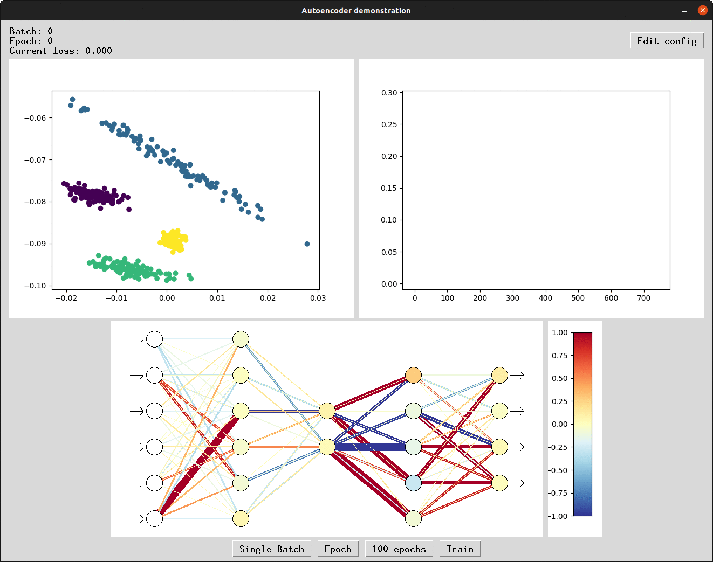

# Autoencoder demonstration

The program aims to demonstrate autoencoder learning and model's feature representation in low dimensional space. The
project is a part of [Soft computing course](https://www.fit.vut.cz/study/course/14810/.en) on the Faculty of
Information Technology Brno University of Technology.

Program is written in pure [numpy](https://numpy.org/) and [matplotlib](https://matplotlib.org/). Graphical user
interface was designed in [PySimpleGUI](https://pysimplegui.readthedocs.io/en/latest/). Full project specification and
documentation could be found [here](/documentation/Documentation.pdf).

The project is licensed under Apache License 2.0.


## Autoencoder

An autoencoder is a type of artificial neural network used to learn efficient codings of unlabeled data. An autoencoder
has two main parts: an encoder that maps the input into the code, and a decoder that maps the code to a reconstruction
of the input.

*<div align="center"> The image was adopted from [Wikipedia](https://en.wikipedia.org/wiki/Autoencoder). </div>*

## Installation
Change directory to the root of the project.
```bash
cd __PROJECT_ROOT__
```

### Configure environment
1. #### Anaconda
    Create new environment with [anaconda distribution](https://www.anaconda.com/) and activate it.
    
    ```bash
    conda create -n sfc python=3.8
    conda activate sfc
    ```

2. #### Venv
    Alternatively [virtual environment](https://docs.python.org/3/library/venv.html) could be used. Ensure to have [python 3.8](https://www.python.org/downloads/release/python-380/) installed.
    
    ```bash
    python3.8 -m venv env
    source env/bin/activate
    ```

Install required packages
```bash
python3.8 -m pip install -r requirements.txt --no-cache-dir
```

Export project root as PYTHONPATH.
```bash
export PYTHONPATH=$PWD:$PYTHONPATH
```

And run gui application by next command.

```bash
python3.8 main.py
```

In case following error appears, your python is not configured for tkinter.
`ModuleNotFoundError: No module named '_tkinter'`


Install necessary python3.8-tk lib by following command (use your package manager).
```bash
sudo apt install python3.8-tk
```

### Hope you  like the program. Cheers :)


